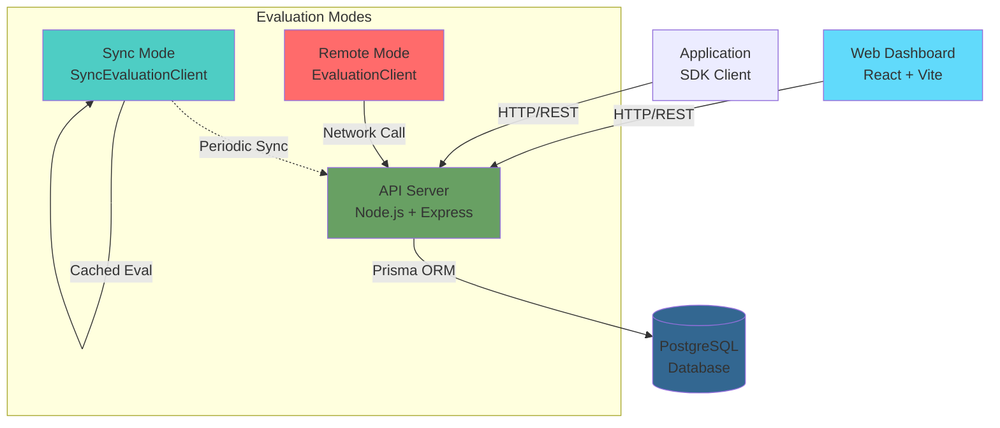

Weapon-X is built around a high-performance, centralized architecture designed for zero-latency feature evaluation. This guide explains the system components, database schema, evaluation modes, and authentication flow.

## System Components

Weapon-X consists of three main components that work together to deliver fast, secure feature flag management:

<CardGroup cols={3}>

<Card title="Web Dashboard" icon="desktop">
  **Frontend Command Center**
  
  Built with React, Vite, Tailwind CSS, and Shadcn/UI. Provides a visual interface for managing projects, configurations, rules, and authentication tokens.
  
  - Project and environment management
  - Configuration and rule editor
  - Role-based access control
  - Real-time audit logs
</Card>

<Card title="API Server" icon="server">
  **Backend Mainframe**
  
  Built with Node.js, Express, and Prisma. Handles all business logic, authentication, and database operations.
  
  - RESTful API endpoints
  - Bearer token authentication
  - Rule evaluation engine
  - Audit logging
</Card>

<Card title="TypeScript SDK" icon="code">
  **Tactical Integration**
  
  Portable client library for Node.js and browser applications. Supports both remote and local evaluation modes.
  
  - AdminClient for management
  - EvaluationClient for remote eval
  - SyncEvaluationClient for local eval
</Card>

</CardGroup>

## Architecture Diagram



## Database Schema

Weapon-X uses PostgreSQL with Prisma ORM. Here's the core schema:

### Core Entities

<Steps>

<Step title="Projects">

The top-level organizational unit. All configurations belong to a project.

```prisma
model Project {
  reference      String       @id @db.VarChar(100)
  name           String       @db.VarChar(255)
  environment_id String?      @db.VarChar(100)
  created_at     DateTime     @default(now())
  updated_at     DateTime     @updatedAt

  environment     Environment?
  configurations  Configuration[]
  authentications Authentication[]
  audit_logs      AuditLog[]
}
```

**Key fields:**
- `reference`: Unique project identifier (e.g., `"my-app-prod"`)
- `environment_id`: Optional link to deployment environment

</Step>

<Step title="Configurations">

Feature flags or configuration values with a type, default value, and optional rules.

```prisma
model Configuration {
  id                String     @id @default(uuid())
  project_reference String     @db.VarChar(100)
  key               String     @db.VarChar(255)
  description       String     @default("")
  type              ConfigType // BOOLEAN | JSON | STRING | SECRET
  is_active         Boolean    @default(true)
  default_value     Json
  validation_schema Json       @default("{}")
  created_at        DateTime   @default(now())
  updated_at        DateTime   @updatedAt

  project Project @relation(fields: [project_reference], references: [reference])
  rules   Rule[]

  @@unique([project_reference, key])
}
```

**Key fields:**
- `key`: Unique identifier within a project (e.g., `"enable_dark_mode"`)
- `type`: One of `BOOLEAN`, `STRING`, `JSON`, or `SECRET`
- `default_value`: Returned when no rules match
- `is_active`: Global kill switch for the configuration

</Step>

<Step title="Rules">

Conditional logic that overrides the default value based on user attributes.

```prisma
model Rule {
  id                 String   @id @default(uuid())
  configuration_id   String   @db.Uuid
  name               String   @db.VarChar(255)
  conditions         Json     // Array of Condition objects
  return_value       Json
  priority           Int      @default(0)
  rollout_percentage Int      @default(100)
  created_at         DateTime @default(now())
  updated_at         DateTime @updatedAt

  configuration Configuration @relation(fields: [configuration_id], references: [id])
}
```

**Key fields:**
- `conditions`: Array of `{attribute, operator, value}` objects (ALL must match)
- `return_value`: Value returned if conditions match
- `priority`: Lower numbers evaluated first (default: 0)
- `rollout_percentage`: Gradual rollout 0-100% (default: 100)

</Step>

<Step title="Authentication">

API keys for accessing the system, linked to roles with permissions.

```prisma
model Authentication {
  id                String    @id @default(uuid())
  project_reference String    @db.VarChar(100)
  role_id           String    @db.Uuid
  secret_key        String    @unique @db.VarChar(512)
  email             String    @db.VarChar(255)
  description       String    @default("")
  is_active         Boolean   @default(true)
  expiration_date   DateTime? @db.Timestamptz
  created_at        DateTime  @default(now())
  updated_at        DateTime  @updatedAt
  removed_at        DateTime? @db.Timestamptz

  project    Project
  role       Role
  audit_logs AuditLog[]
}
```

**Key fields:**
- `secret_key`: Bearer token for API authentication
- `role_id`: Links to a Role with specific permissions
- `is_active`: Can be disabled without deletion
- `expiration_date`: Optional automatic expiry

</Step>

<Step title="Roles">

Define permission sets for authentication tokens.

```prisma
model Role {
  id          String   @id @default(uuid())
  name        String   @unique @db.VarChar(100)
  permissions String[] // Array of permission strings
  created_at  DateTime @default(now())
  updated_at  DateTime @updatedAt

  authentications Authentication[]
}
```

**Example permissions:**
- `configs:read`, `configs:write`
- `rules:read`, `rules:write`
- `projects:read`, `projects:write`

</Step>

</Steps>

## Evaluation Modes

Weapon-X offers two distinct evaluation strategies depending on your performance and observability needs:

### Remote Evaluation Mode

Uses `EvaluationClient` to evaluate flags on the server with full audit logging.

```typescript
import { EvaluationClient } from 'weapon-x-sdk';

const client = new EvaluationClient({
  baseUrl: 'http://localhost:3001',
  headers: { Authorization: 'Bearer YOUR_SECRET_KEY' }
});

const response = await client.evaluate({
  filters: { user_tier: 'beta', country: 'US' },
  keys: ['enable_dark_mode', 'rate_limits'],
  identifier: 'user-12345'
});
```

**Pros:**
- Full audit trail for compliance
- Always up-to-date (no cache staleness)
- Secure for sensitive configurations

**Cons:**
- Network latency on every evaluation
- Requires server availability

**Use cases:** Admin panels, low-frequency evaluations, audit-critical features

### Sync Evaluation Mode

Uses `SyncEvaluationClient` to cache configurations locally and evaluate in-memory.

```typescript
import { SyncEvaluationClient } from 'weapon-x-sdk';

const syncClient = SyncEvaluationClient.getInstance({
  baseUrl: 'http://localhost:3001',
  headers: { Authorization: 'Bearer YOUR_SECRET_KEY' }
});

// Sync once (e.g., on app startup)
await syncClient.sync('my-app-prod');

// Evaluate instantly with zero network latency
const results = syncClient.evaluate({
  filters: { user_tier: 'beta', country: 'US' },
  keys: ['enable_dark_mode', 'rate_limits'],
  identifier: 'user-12345'
});
```

**How it works:**
1. `sync()` fetches all configurations for a project via `/v1/admin/projects/{reference}/configs`
2. Configurations are cached in a `Map<string, Config>` in memory
3. `evaluate()` runs the rule engine locally using the cached data
4. Rollout percentages use SHA-256 hashing of `identifier + ruleId` for deterministic results

**Pros:**
- Zero network latency (&lt;1ms evaluation)
- Works offline after initial sync
- Reduced server load

**Cons:**
- No audit logging per evaluation
- Requires periodic re-sync for updates
- Larger memory footprint

**Use cases:** High-traffic APIs, mobile apps, real-time features, edge computing

<Note>
The `SyncEvaluationClient` uses a singleton pattern. Call `getInstance()` to reuse the same instance across your application.
</Note>

## Authentication Flow

Weapon-X uses Bearer token authentication for all API requests:

<Steps>

<Step title="Create Authentication Token">

Generate an API key linked to a role with specific permissions:

```typescript
const auth = await admin.createAuthentication({
  project_reference: 'my-app-prod',
  role_id: '<role-uuid>',
  secret_key: 'sk_live_a1b2c3d4e5f6g7h8i9j0',
  email: 'admin@example.com',
  description: 'Production API token',
  is_active: true,
  expiration_date: '2026-12-31T23:59:59.000Z'
});
```

</Step>

<Step title="Authorization Middleware">

The server validates tokens using the `authorize()` middleware:

```typescript
// From server/src/middleware/authorization.ts
export function authorize(
  authRepo: IAuthenticationRepository,
  requiredPermissions: string[] = []
) {
  return async (req: Request, res: Response, next: NextFunction) => {
    // 1. Extract Bearer token from Authorization header
    const header = req.headers.authorization;
    const token = header?.slice(7).trim();

    // 2. Look up authentication record
    const auth = await authRepo.findBySecretKey(token);

    // 3. Validate: is_active, expiration_date
    if (!auth.is_active || isExpired(auth.expiration_date)) {
      return res.status(401).json({ error: 'Unauthorized' });
    }

    // 4. Check role permissions
    const rolePermissions = auth.role?.permissions ?? [];
    const missing = requiredPermissions.filter(
      p => !rolePermissions.includes(p)
    );

    if (missing.length > 0) {
      return res.status(403).json({
        error: 'Forbidden',
        message: `Missing permissions: ${missing.join(', ')}`
      });
    }

    // 5. Attach auth to request for downstream use
    req.auth = auth;
    next();
  };
}
```

</Step>

<Step title="Token Introspection">

Validate a token programmatically:

```typescript
const result = await admin.introspect('sk_live_a1b2c3d4e5f6g7h8i9j0');

if (result.active) {
  console.log('Token is valid');
  console.log('Expires at:', new Date(result.exp * 1000));
} else {
  console.log('Token is invalid or expired');
}
```

</Step>

</Steps>

## Rule Evaluation Engine

The evaluation engine processes rules in priority order and returns the first match:

```typescript
// Simplified algorithm from sync-evaluation-client.ts
function evaluate(data: EvaluateRequest): Record<string, EvaluationResult> {
  const results: Record<string, EvaluationResult> = {};

  for (const key of data.keys) {
    const config = cache.get(key);

    // Check if configuration exists and is active
    if (!config) {
      results[key] = { value: null, rule_id: 'none', reason: 'FALLBACK' };
      continue;
    }

    if (!config.is_active) {
      results[key] = { value: null, rule_id: 'none', reason: 'DISABLED' };
      continue;
    }

    // Evaluate rules in priority order (lowest first)
    for (const rule of config.rules.sort((a, b) => a.priority - b.priority)) {
      // Check if ALL conditions match
      const allMet = rule.conditions.every(condition => {
        const contextValue = data.filters[condition.attribute];
        return evaluateCondition(contextValue, condition.operator, condition.value);
      });

      if (allMet) {
        // Check rollout percentage
        if (rule.rollout_percentage < 100) {
          const hash = computeRolloutHash(data.identifier, rule.id);
          if (hash >= rule.rollout_percentage) {
            continue; // User not in rollout
          }
        }

        // Rule matched!
        results[key] = {
          value: rule.return_value,
          rule_id: rule.id,
          reason: 'MATCH'
        };
        break;
      }
    }

    // No rules matched, use default value
    if (!results[key]) {
      results[key] = {
        value: config.default_value,
        rule_id: 'default',
        reason: 'FALLBACK'
      };
    }
  }

  return results;
}
```

<Warning>
Rollout percentage uses SHA-256 hashing of `identifier + ruleId` to ensure users consistently see the same variant. Always provide a stable identifier like a user ID.
</Warning>

## Deployment Architecture

Weapon-X is designed to run in containerized environments:

```yaml
# docker-compose.yml
version: "3.9"

services:
  db:
    image: postgres:16-alpine
    ports:
      - "5432:5432"
    environment:
      POSTGRES_USER: weapon_x
      POSTGRES_PASSWORD: weapon_x
      POSTGRES_DB: weapon_x

  api:
    build: .
    ports:
      - "3001:3001"
    depends_on:
      db:
        condition: service_healthy
    environment:
      DATABASE_URL: postgresql://weapon_x:weapon_x@db:5432/weapon_x
      PORT: 3001
```

**Production recommendations:**
- Use managed PostgreSQL (RDS, Cloud SQL, etc.)
- Deploy API server behind a load balancer
- Enable HTTPS with TLS certificates
- Set up monitoring and alerting
- Implement rate limiting and DDoS protection

## Next Steps

<CardGroup cols={2}>

<Card title="Configuration Types" icon="sliders" href="/concepts/configurations">
  Learn about BOOLEAN, STRING, JSON, and SECRET types
</Card>

<Card title="Conditional Rules" icon="code-branch" href="/concepts/rules">
  Master targeting with operators and rollout percentages
</Card>

<Card title="API Reference" icon="book" href="/api/overview">
  Explore all REST API endpoints
</Card>

<Card title="SDK Reference" icon="code" href="/sdk/installation">
  Dive into AdminClient, EvaluationClient, and SyncEvaluationClient
</Card>

</CardGroup>
